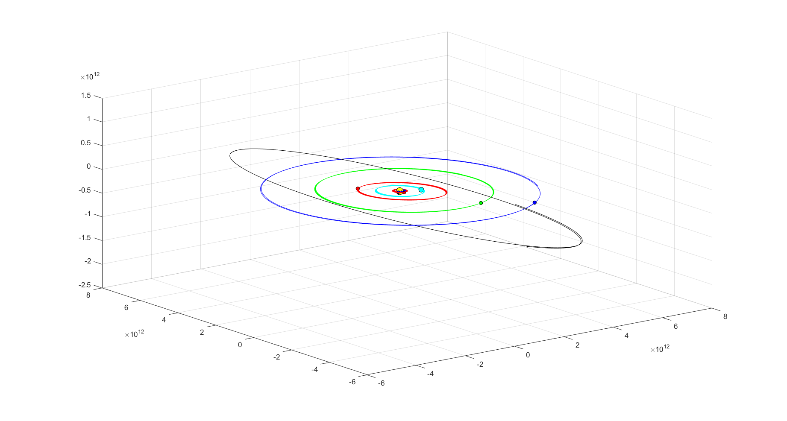

# solarSystem

## Overview

**solarSystem** is a simulation of the [Solar System](https://en.wikipedia.org/wiki/Solar_System) in MATLAB. It posseses the following characteristics:

- Developed with MATLAB R2019b;
- Simulated using the [Newton's law of universal gravitation](https://en.wikipedia.org/wiki/Newton%27s_law_of_universal_gravitation);
- The differential equation was resolved numerically using the [Euler method](https://en.wikipedia.org/wiki/Euler_method);

## Usage

Download this project and run the `solarSystem.m` script using your MATLAB. It should produce an animation of the orbits of the planets in the solar system, just like this picture:

